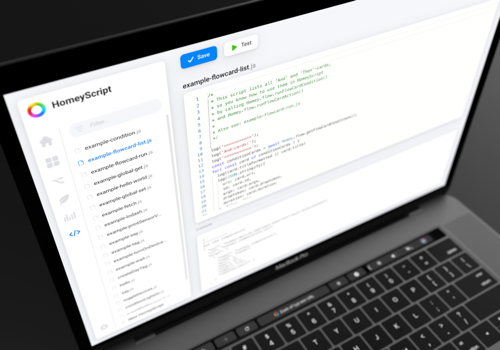
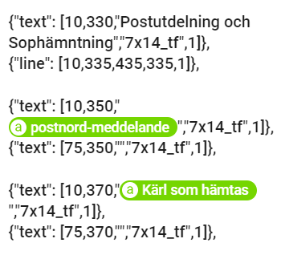
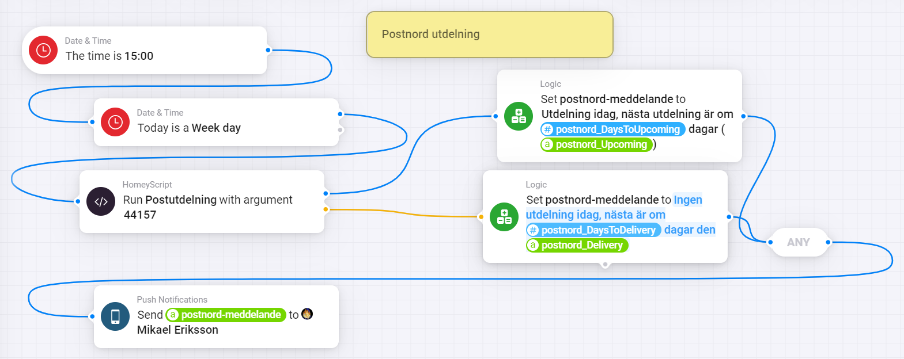
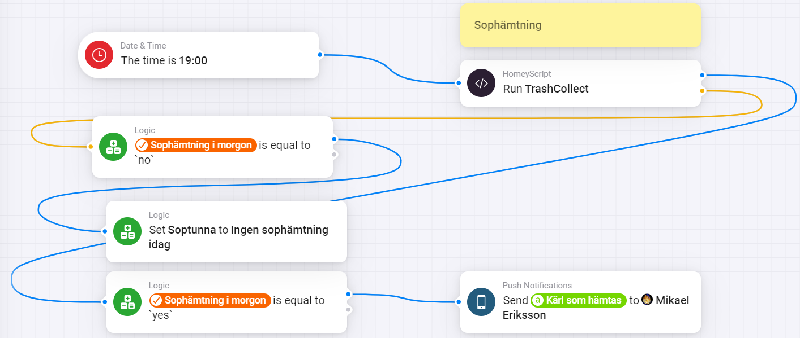

<p align="center"></p><br>

# Use HmeyScript in Displays<br>
#### I just want to mention that I am not an expert in Java Script, but with good help you can get it working<br>
This guide is for the OpenEPaperLink homey app.<br> [](https://homey.app/sv-se/app/nl.wiggert.OpenEPaperLink/OpenEPaperLink/)
<br>
Here you find the HomeyScript app.<br> [](https://homey.app/sv-se/app/com.athom.homeyscript/HomeyScript/)
<br>
HomeyScript video guide <br> [](https://youtu.be/whfEHQYo2_8 "Script your own Smart Home with HomeyScript")<br>
This is an good online editor <br> [](https://www.sololearn.com/en/compiler-playground/web)<br>

⭐ All credit for the PostNord code goes to Fredrik Ahnell. [](https://github.com/FreddHomey)<br>
⭐ All credit for the TrashCollect code goes to Johan Bendz. [](https://github.com/JohanBendz)<br>


#### This code is just an example of a Javascript code, nothing I use myself, so just an example.<br>
```
    function isTodayBetweenDates(startDate, endDate) {
  const today = new Date();
  const start = new Date(today.getFullYear(), startDate.getMonth(), startDate.getDate());
  const end = new Date(today.getFullYear(), endDate.getMonth(), endDate.getDate())
  console.log("Start date: ", start)
  console.log("End date: ", end)
  return (today >= start && today <= end);
}

const startDate = new Date('2026-03-15');
const endDate = new Date('2026-03-31');
const isTodayInRange = isTodayBetweenDates(startDate, endDate);
console.log("Is today between", startDate, " and ", endDate)
console.log("Result: ", isTodayInRange);
return isTodayInRange
```
I will not go through how to install the scripts in HomeyScript.<br>
There is already a lot of information about this online.<br>
Even via the Youtube video at the beginning of the page, there is everything you need to know.<br>

What I will show is the advanced Flows for the PostNord and TrashCollect script.<br>
The way I set them up and which then also update the tags that I use in a parsed version for the displays in Homey Pro.<br>
This can generate a lot of text from the tags, so I run this in a 7.4" display and not in the smaller 2.9" displays.<br>

⭐ Here is the PostNord code. [](https://github.com/FreddHomey/PostNord-Utdelning/blob/main/PostNord-Checker.js)<br>
⭐ Here is the TrashCollect code. [](https://github.com/JohanBendz/HomeyScripts/blob/master/TrashCollect_manual_dates)<br>

### This is the parsed version code in Homey<br>



# Here is the two Advanced flows in Homey

### PostNord Flow<br>
<br>

### TrashCollect Flow<br>
<br>

# Ready to go 
### Now you are ready to start using HomeyScript and your displays to get more out of it.
#### Basically it's just copy and paste in HomeyScript.<br> Then set up the flow and add the tags in the parsed version code to get it to work.

# Support the work [](https://ko-fi.com/wizz666)
