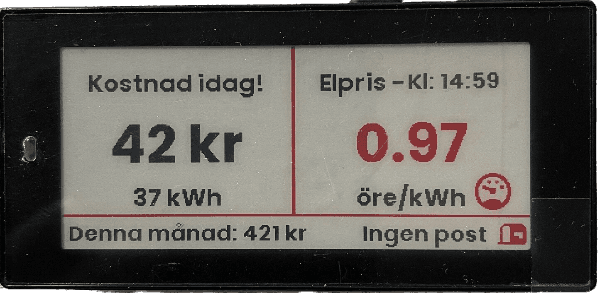
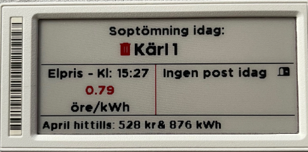
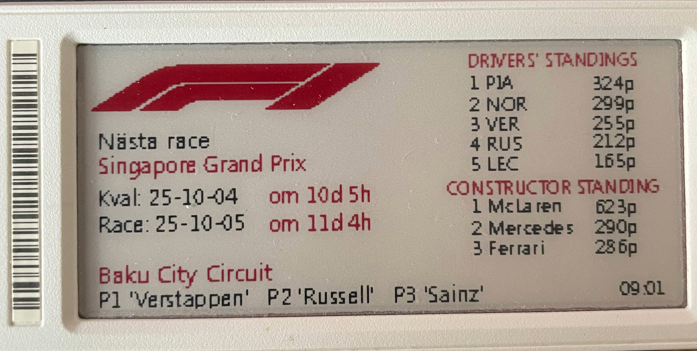

# OpenEPaperLink integration for Hme Assistant

[](https://www.home-assistant.io/)<br>
Home Assistant Integration for the [](https://github.com/jjwbruijn/OpenEPaperLink)<br>
Home Assistant guide from [](https://github.com/jonasniesner/open_epaper_link_homeassistant)<br>
Wiki code examples [](https://github.com/jonasniesner/open_epaper_link_homeassistant.wiki.git)<br>
Home Assistant [](https://community.home-assistant.io/t/anyone-looked-into-using-electronic-price-tag-screens-with-ha/407649/1)<br>
E-paper display [](https://community.home-assistant.io/t/e-paper-display/138625)

Here is a code that I made according to this template [](https://github.com/jonasniesner/open_epaper_link_homeassistant/wiki/Electricity-price-and-usage-costs)<br>
It works perfectly fine to run in Home Assistant and that generates what I want to achieve via the sensors I added from tibber and tibber pulse.<br>
This after I implemented Homey Pro with Home Assistant to get values from Homey pro and be able to use them in Home Assistant.<br>
This was only possible after I followed this guide on how to connect Homey pro with Home assistant after a successful connection using MQTT.<br>
[](https://community.homey.app/t/tutorial-pro-how-to-integrate-home-assistant-with-homey/92641)<br>
The extra functions in this file is the arrow that turns red and face downwards if the current price is below 1Kr and turns upwards if the current price is over 1Kr and also then changes the arrow to black.<br>
Likewise, with the current price that changes color according to the price.<br>

Put in your Display ID in the code and add your own sensors to it and you are good to go. <br>
Here is an example of one of my displays running the below code with some modifications.<br>
I will post a new code when I am satisfied with the result.<br>

<br>

```
    service: open_epaper_link.drawcustom
target:
  entity_id: open_epaper_link.Put in your own display ID here
data:
  background: white
  dry-run: false
  ttl: 60
  rotate: 0
  payload:
    - type: line
      fill: red
      width: 3
      x_start: 148
      y_start: 0
      x_end: 148
      y_end: 110
    - type: line
      fill: red
      width: 2
      x_start: 0
      y_start: 109
      x_end: 296
      y_end: 109
    - type: text
      value: Kostnad idag!
      font: ppb.ttf
      x: 74
      "y": 20
      size: 20
      color: black
      anchor: mm
    - type: text
      value: >-
        {{ states('sensor.tibber_pulse_accumulated_cost') |
        round(0) }} kr
      font: ppb.ttf
      x: 74
      "y": 58
      size: 38
      color: >-
        {{ 'black' if
        states('sensor.tibber_pulse_accumulated_cost') |
        round(0) | int <= 50 else 'red' }}
      anchor: mm
    - type: text
      value: >-
        {{
        states('sensor.tibber_pulse_accumulated_consumption')
        | round(0) }} kWh
      font: ppb.ttf
      x: 74
      "y": 90
      size: 20
      color: >-
        {{ 'black' if
        states('sensor.tibber_pulse_accumulated_consumption')
        | round(0) | int <= 100 else 'red' }}
      anchor: mm
    - type: text
      value: Elpris nu!
      font: ppb.ttf
      x: 225
      "y": 20
      size: 20
      color: black
      anchor: mm
    - type: text
      value: >
        
         
          {{ electricity_price_state }}
        
          
            {{ electricity_price_state }}
          
            {{ electricity_price_state }}
          
        
      font: ppb.ttf
      x: 224
      "y": 60
      size: 36
      color: red
      anchor: mm
    - type: text
      value: >-
        {{ 'öre/kWh' if states('sensor.electricity_price') |
        round(2) < 1 else 'Kr/kWh' }}
      font: ppb.ttf
      x: 224
      "y": 90
      size: 18
      color: black
      anchor: mm
    - type: icon
      value: >-
        {{ 'arrow-up' if states('sensor.electricity_price') |
        round(2) >= 1 else 'arrow-down' }}
      x: 160
      "y": 95
      size: 20
      color: >-
        {{ 'black' if states('sensor.electricity_price') |
        round(2) >= 1 else 'red' }}
      anchor: mm
    - type: text
      value: >-
        Hittils denna månad: {{ states('sensor.monthly_cost')
        | round(0) }} kr
      font: ppb.ttf
      x: 3
      "y": 120
      size: 12
      color: black
      anchor: lm
    - type: text
      value: "Kl: {{ now() | as_timestamp() | timestamp_custom('%H:%M', true) }}"
      font: ppb.ttf
      x: 235
      "y": 120
      size: 12
      color: black
      anchor: lm

```
<br>

The layout for this display abow you need to add your own sensors.<br>
You also need to have the Swedish Post Delivery integration for Home Assistant installed and configured for your postal code.<br>
[Here is the code for the layout](https://github.com/wizz666/OpenEpaperLink-Homey-Pro/blob/main/Sample%20code%20Home%20Assistant)<br>

<br>

The layout for this display abow you need to add the sensors in HA and use it like the example code below.<br>
[Here you find the F1 Sensor for Home Assistant](https://github.com/Nicxe/f1_sensor)<br>
[Here is the example code for the layout](https://github.com/wizz666/OpenEpaperLink-Homey-Pro/blob/main/Sample%20code%20F1)<br>
