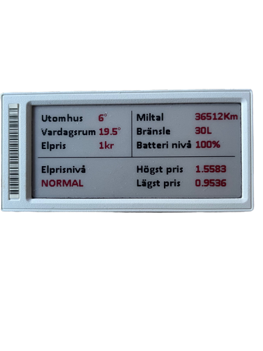

# Display parsed version in Homey Pro
 
This is an example on the code to use and edit for the OpenEPaperLink homey app  https://homey.app/sv-se/app/nl.wiggert.OpenEPaperLink/OpenEPaperLink/
 the code is for Solum 2.9" display and for the card display parsed Version of: in the homey app.

The file is in Json and this is an good online editor - https://jsonbeautifier.org/ 
Information regarding Json template - https://github.com/jjwbruijn/OpenEPaperLink/wiki/Json-template 
Feel free to change and use it as you like. 

