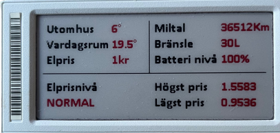
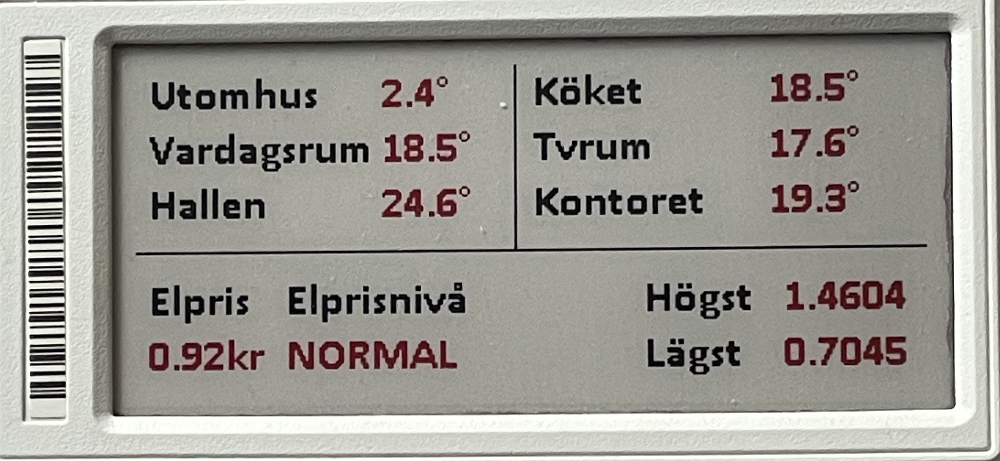
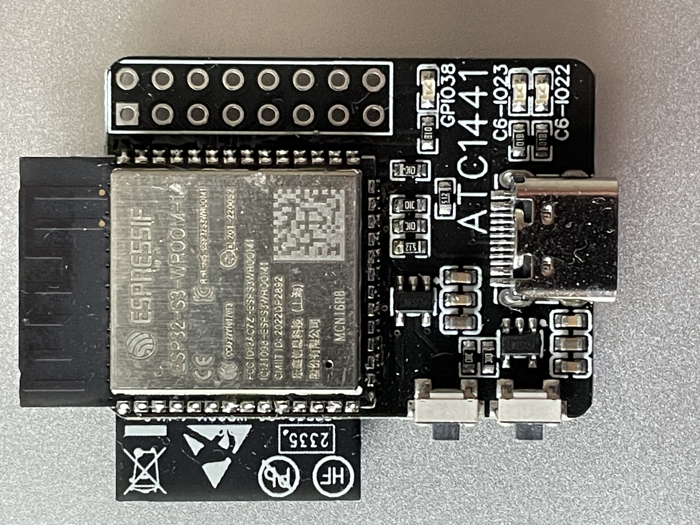
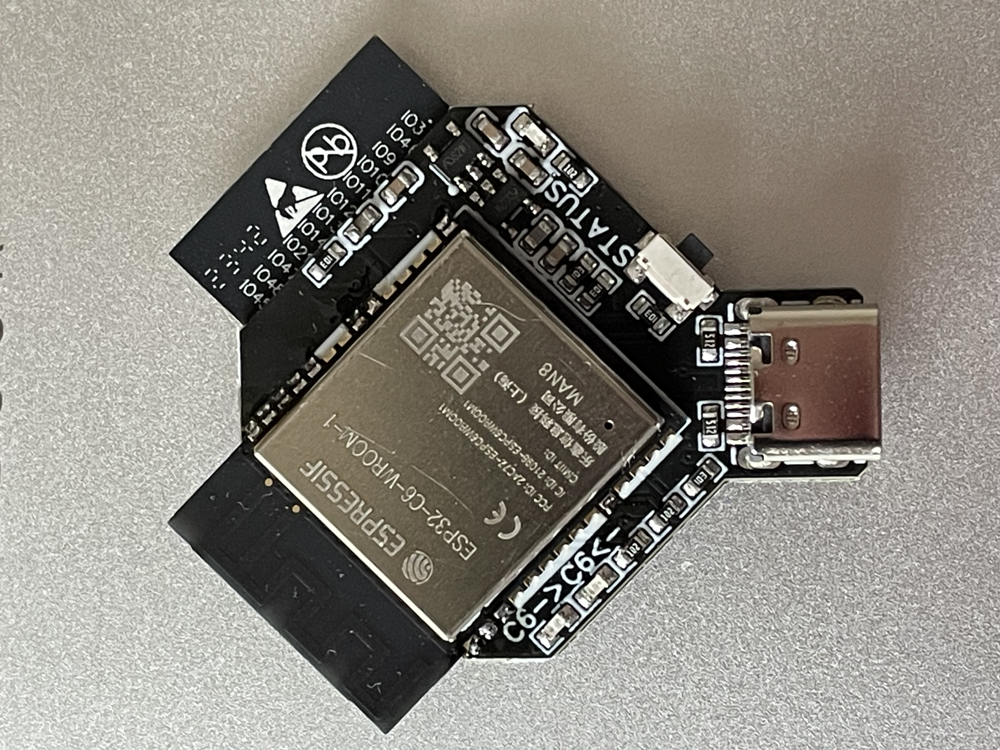

# Display parsed version in Hmey Pr
### The code is for Solum 2.9" BWR and BW displays but can be modifyed to fit other displays.<br>
This guide is for the OpenEPaperLink homey app.<br> [](https://homey.app/sv-se/app/nl.wiggert.OpenEPaperLink/OpenEPaperLink/)
<br>
Information regarding Json template <br> [](https://github.com/jjwbruijn/OpenEPaperLink/wiki/Json-template)<br>
This is an good online editor <br> [](https://jsonbeautifier.org/)<br>

In this section you change the text and insert the card from the Homey app that you want to be displayed.<br> 
Here you also change the positions for the text and for the card so that it fits on the display.<br>
It is important that the code below is between brackets [ ] otherwise it will not work, you can see how it looks in the Sample code above.<br>
```
    [ {"text": [10,20,"Add your text here","t0_14b_tf",1]},
    {"text": [95,20,"Here you add the card from homey","t0_14b_tf",2]}, ]
```
If you want to add som text or sybols after the card you can do that.<br>
Just do it as in the picture below that shows the code.<br>
Here i added degrees (°) and also percent (%) and text for the the currency in my case SEK (Kr)<br>
Add whatever you want to customize it to your needs.<br>
Be careful not to get a lot of white space in between because it shifts the code.<br> 
This will only appear after you have uploaded the code to your AP and it has sent the code over to your display.<br>
Feel free to change and use the code as you like.<br> 

⭐ All credit for the code goes to Fredrik Tornell.<Br>
⭐ All credit for the pictures in this guide goes to Aaron Christophel @atc1441 [](https://github.com/atc1441)<br>
⭐ For Home Assistant users [](https://github.com/wizz666/OpenEpaperLink-Homey-Pro/blob/main/Integration%20for%20Home%20Assistant.md)<br>
⭐ How to use HomeyScript [](https://github.com/wizz666/OpenEpaperLink-Homey-Pro/blob/main/HomeyScript.md)
<br>


2.9" BWR display examples           |  This is how it looks in Homey
:-------------------------:|:-------------------------:
<br> |  


# AP installation
If you bought an AP from me, it comes fully flashed and ready for installation.<br>
What you need to do is connect power to your AP with at least 1A After that you can go to the ip that the AP has pre-installed (192.168.4.1).<br>
when you go to that address you will get the interface for the AP and now you should enter your own network and log in with your user credentials for your network and then your AP is up and running in your network.<br>


# Start upp the display from deep sleep
Now we will start up the display which is in deep sleep and to wake up the display you need to remove the batteries.<br>
Take it easy as the cover that covers the batteries is very tight and can be difficult to remove.<br>
When the cover is gone, remove the batteries and take a battery and carefully insert the battery in the wrong direction for about 10 seconds, then you short-circuit the battery leads (See the picture which tins should be cross-circuited)<br>
Then you insert the batteries in the correct position and close the door.<br>
It will take a little while before the screen reboots but when it does it will find your AP and the display will then appear in your AP.<br>
When it has been found by your AP, you can choose to run one of the pre-installed scripts from your AP (See the pictures below) or make an integration via the Homey app or Home assistant and more.<br>
<br>
<br>
<br>
<br>

# 3D files
Click on the links below<br>
3D files for the S3_C6_NanoAP v.1 and also for S3_C6_NanoAP v.2  [3D Case for Nano AP v1 and v2](https://github.com/wizz666/OpenEpaperLink-Homey-Pro/tree/main/3D%20Case%20for%20Nano%20AP%20v1%20and%20v2)<br>
3D files for wall mounts and table stands for the displays in this link [3D Stand and holder for the display](https://github.com/wizz666/OpenEpaperLink-Homey-Pro/tree/main/3D%20Stand%20and%20holder%20for%20the%20display)<br>
This is the S3_C6_NanoAP v.1            |  This is the S3_C6_NanoAP v.2
:-------------------------:|:-------------------------:
 |  

# 3D files (HOLDER & STANDS)
Click on the link below<br>
3D files [holder and stands for every tag. 1.54", 2.9" and 4.2](https://github.com/OpenEPaperLink/OpenEPaperLink/tree/master/Hardware/3D-Printed)<br>


# Ready to go 
### Now you are ready to start using your AP and display and only your imagination sets the limits.<br>
⭐ The OpenEPaperLink startup guide video by Aaron Christophel @atc1441 [](https://youtu.be/Etonkolz9Bs "Watch the OpenEPaperLink startup guide video")

# Support the work [](https://ko-fi.com/wizz666)

